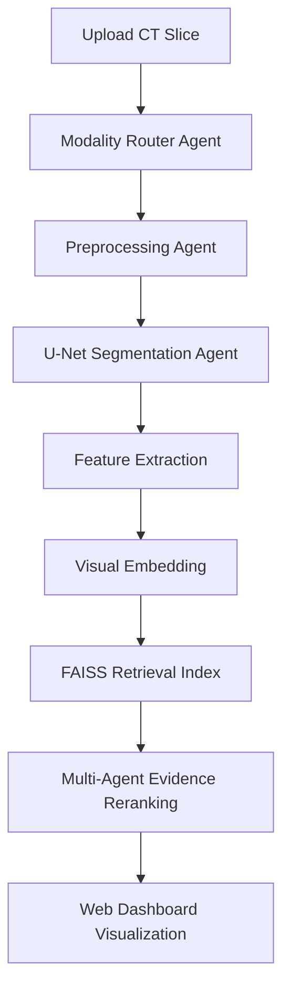

# Multi-Agent Deep Learning Framework for Liver Cancer Image Retrieval

An advanced, end-to-end framework utilizing a multi-agent deep learning approach for structurally similar medical image retrieval. Specifically designed for Hepatocellular Carcinoma (HCC), this platform rapidly matches an uploaded CT slice or a queried patient to highly similar reference cases by leveraging semantic segmentation, structured feature extraction, and FAISS vector indexing.

> **Research Prototype** — This system is built for research and demonstration purposes. It is not intended for clinical diagnosis or treatment decisions.

---

## 🌟 Key Features

- **End-to-End Pipeline**: From raw DICOM/NIfTI ingestion to an interactive web dashboard.
- **Multi-Agent Architecture**: Decouples feature extraction, segmentation, and multimodal fusion to specialized sub-agents.
- **Deep Feature Indexing**: Utilizes **FAISS** to rapidly query thousands of CT slices in milliseconds.
- **Automated Semantic Segmentation**: Detects and localizes Liver, HCC Mass, Portal Vein, and Abdominal Aorta.
- **Zero Patient Leakage**: Guaranteed 0% overlap between Train (72 patients), Validation (15 patients), and Test (17 patients) splits.
- **Interactive UI**: A beautifully crafted React (Vite) + Tailwind CSS v4 dashboard providing seamless CT analysis and on-the-fly image uploads.

---

## 🏗️ System Architecture



### Segmentation Classes
The model extracts the following semantic classes:
| ID | Class | Color Code |
|:---|:---|:---|
| 0 | Background | Slate/None |
| 1 | Liver | Red |
| 2 | HCC Mass | Yellow |
| 3 | Portal Vein | Blue |
| 4 | Abdominal Aorta | Green |

---

## 🛠️ Technology Stack

- **Frontend**: React 18, Vite, Tailwind CSS v4, Recharts, Lucide Icons, TypeScript
- **Backend API**: FastAPI, Uvicorn, Python-Multipart
- **Deep Learning / AI**: PyTorch, Torchvision, FAISS (Vector Database)
- **Image Processing**: PIL, NumPy, OpenCV
- **Data Management**: Pandas, JSON Indexing

---

## 🚀 Installation & Setup

### Prerequisites
- Python 3.10+
- Node.js 18+ (20+ recommended)
- Git

### 1. Clone the Repository
```bash
git clone git@github.com:Saravanan2005real/Multi-Agent-Deep-Learning-Framework-for-Liver-Cancer-Image-Retrieval-Using-Medical-Imaging-Data.git
cd Multi-Agent-Deep-Learning-Framework-for-Liver-Cancer-Image-Retrieval-Using-Medical-Imaging-Data
```

### 2. Backend Setup
Set up your virtual environment and install the required dependencies:
```bash
# Create and activate virtual environment (Windows)
python -m venv .venv
.\.venv\Scripts\Activate.ps1

# Install backend dependencies
pip install fastapi uvicorn python-multipart pydantic numpy pillow
```

### 3. Frontend Setup
Install the required node modules for the Vite React application:
```bash
cd web
npm install
```

### 4. Running the Application
The platform requires two separate terminal windows.

**Terminal 1: FastAPI Backend**
```bash
.\.venv\Scripts\Activate.ps1
uvicorn backend.main:app --host 0.0.0.0 --port 8000
```
*The backend API will run at `http://localhost:8000`*

**Terminal 2: React Frontend**
```bash
cd web
npm run dev
```
*The web interface will be accessible at `http://localhost:5173`*

---

## 📊 Dataset Specifications
Based on the integrated **MedOtter/HCC-TACE-Seg** dataset processing:
- **Total Processed Patients**: 104 
- **Total Valid Slices**: 11,277
- **Train Split**: 72 patients
- **Validation Split**: 15 patients
- **Test Split**: 17 patients

---

## 📂 Project Structure

```text
├── backend/                  # FastAPI Application
│   ├── api/                  # API routers (stats, patients, upload, retrieval)
│   ├── services/             # Core logic (retrieval_service, image_service)
│   └── main.py               # Entry point
├── web/                      # React Frontend Application
│   ├── src/
│   │   ├── api/              # Fetch wrappers & API client
│   │   ├── pages/            # Dashboard, Upload, Analysis, Agents, Dataset
│   │   ├── App.tsx           # React Router implementation
│   │   └── index.css         # Tailwind v4 configuration
│   └── index.html
├── scripts/                  # Utilities (e.g., FAISS demo index generator)
├── data/                     # (Gitignored) Raw and processed DICOM/PNG data
└── configs/                  # Pipeline configurations
```

---

## 📝 License
This project is released under the **MIT License**. Dataset usage is subject to the original MedOtter HCC-TACE-Seg license agreements. Do not use this for clinical deployment without extensive FDA/CE validation.
